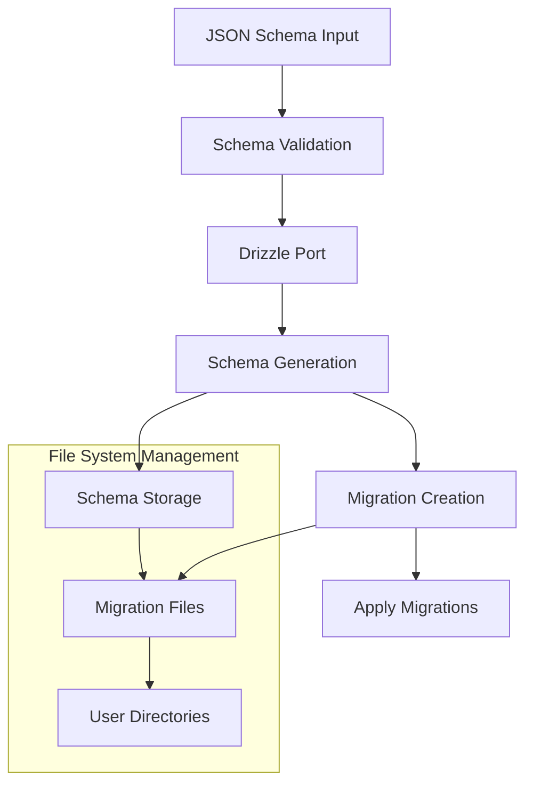

# Drizzle Schema Engine Service

To manage user input db schema declared in JSON format.

## Endpoint

### `/schema/generate`

This POC endpoint accepts a JSON schema definition and user ID. Generate Drizzle schema and execute migration. We can break down sub step as we want according to our use case.

```http
POST /schema/generate
Content-Type: application/json

{
  "userID": "string",
  "schema": "JSONSchemaDefinition"
}
```

1. Accepts a JSON schema definition and user ID
2. Generates a Drizzle-compatible schema
3. Creates and executes necessary database migrations

## Architecture



### Dependencies Wrappers For File System and Drizzle-kit

### Drizzle Port (I named it as such for now)

The core component that handles database operations through drizzle-kit:

- Schema generation from JSON definitions
- Migration execution
- Schema validation
- Database operations management

The Drizzle Port ensures proper translation of JSON schema definitions into database-ready Drizzle schemas and handles the execution of resulting migrations.

### File System Management (This can be replace with FTP or S3)

Handles the organization of generated artifacts:

- Schema file storage
- Migration file management
- User-specific directory structure

All generated schemas and migrations are stored in user-specific directories under the `drizzle/` path, ensuring proper isolation of different users' schema definitions.

## Example Schema

Here's an example of a JSON schema definition that can be sent to the service:

```json
{
  "tables": [
    {
      "name": "users",
      "columns": [
        {
          "name": "id",
          "type": "serial",
          "primaryKey": true
        },
        {
          "name": "email",
          "type": "varchar",
          "unique": true
        },
        {
          "name": "created_at",
          "type": "timestamp",
          "default": "CURRENT_TIMESTAMP"
        }
      ]
    }
  ]
}
```

## Generated Artifacts

For each schema generation request, the service creates:

1. A Drizzle schema file (`.ts`)
2. Migration files in the user's directory
3. Execution logs and status reports

All artifacts are organized by user ID in the `drizzle/` directory structure:

```
drizzle/
  {userID}/
    schema.ts
    migrations/
      0000_initial.sql
      0001_update.sql
    logs/
      generation.log
```
